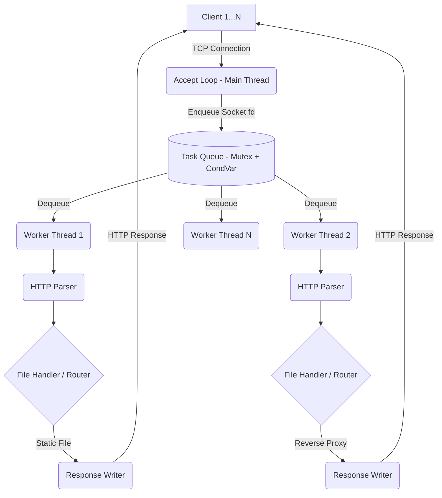

# tokoro

> **tokoro** is a from-scratch C++20 HTTP/1.1 server *and* an experimental inference-aware reverse proxy. Unlike general-purpose proxies (nginx, HAProxy), tokoro routes requests using application-layer signals — prompt-prefix hashing for KV-cache affinity, token-budget accounting for load balancing, request coalescing, mid-stream failover, and per-tenant token-rate limiting — yielding higher cache-hit rates and lower tail latency for LLM inference workloads.

## Architecture (Phase 1)



## Capability Comparison vs nginx

| Capability                                                | nginx | tokoro (P2) | tokoro (P3) |
|-----------------------------------------------------------|:-----:|:-----------:|:-----------:|
| Round-robin / least-conn LB                               |   ✅   |      ✅      |      ✅      |
| Route by **request body content** (system prompt prefix)  |   ❌   |      ✅      |      ✅      |
| **Prefix-hash affinity** for KV-cache reuse               |   ❌   |      ✅      |      ✅      |
| **Prefix-cache hint table** across backends               |   ❌   |      ❌      |      ✅      |
| LB by **estimated tokens**, not request count             |   ❌   |      ✅      |      ✅      |
| **Cancel upstream** on SSE client disconnect              |   ⚠️   |      ✅      |      ✅      |
| **Request coalescing** for identical in-flight prompts    |   ❌   |      ❌      |      ✅      |
| **Mid-stream upstream failover**                          |   ❌   |      ❌      |      ✅      |
| Per-tenant **token-rate** limiting (not req/s)            |   ❌   |      ❌      |      ✅      |
| `epoll`-based non-blocking core                           |   ✅   |      ❌      |      ✅      |
| Prometheus metrics tailored to LLM serving                |   ⚠️   |      ❌      |      ✅      |

## Building & Running

### Requirements
- CMake 3.20+
- Modern C++ compiler (C++20 support)
- macOS / Linux (POSIX APIs)

### Build Instructions
```bash
mkdir build
cd build
cmake ..
cmake --build .
./tokoro
```
